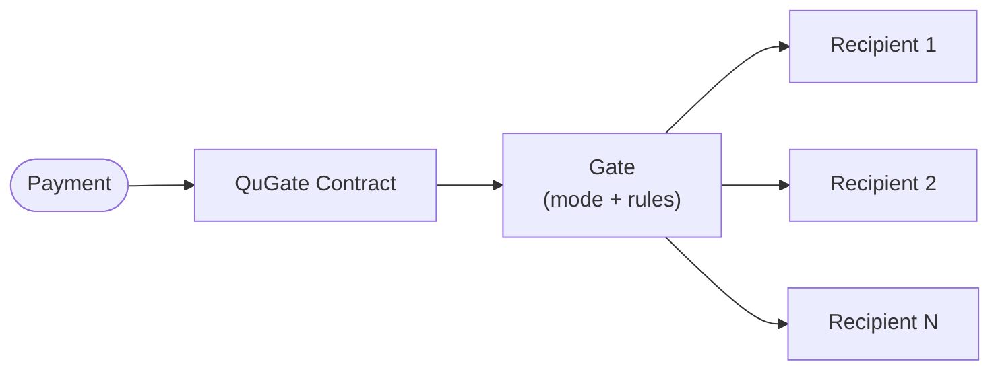
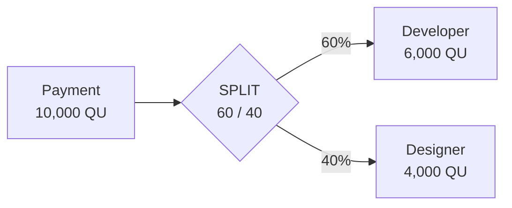
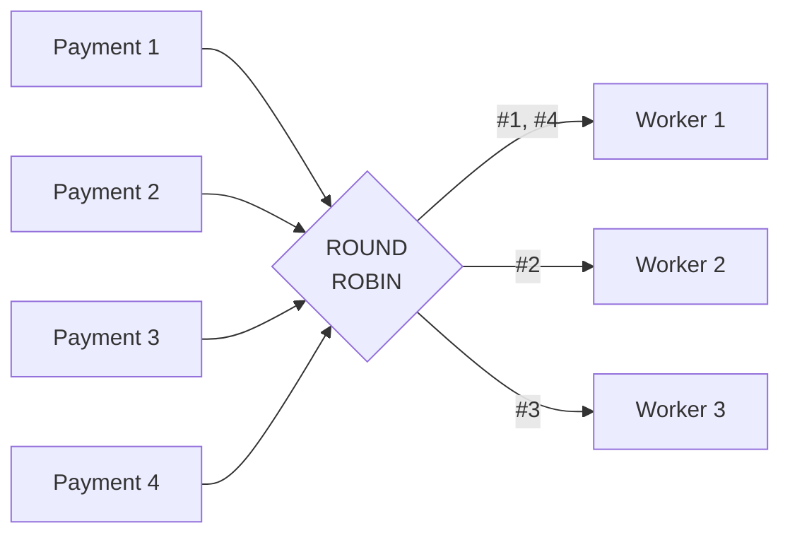
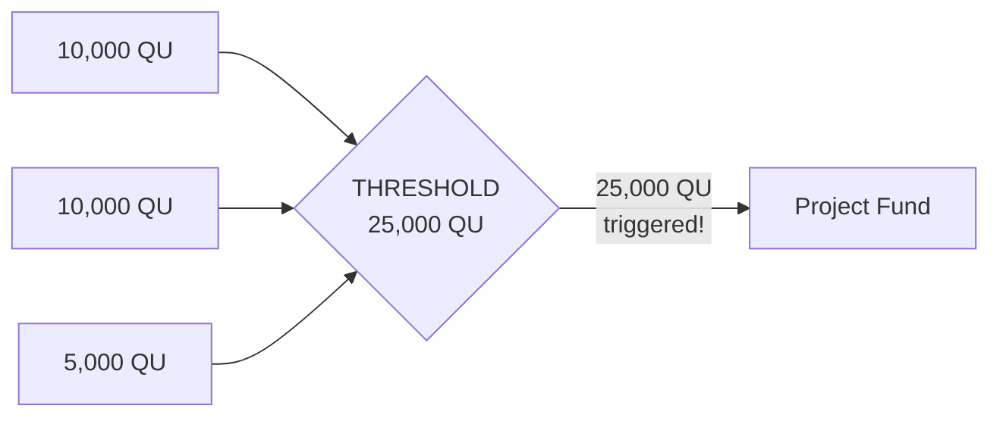
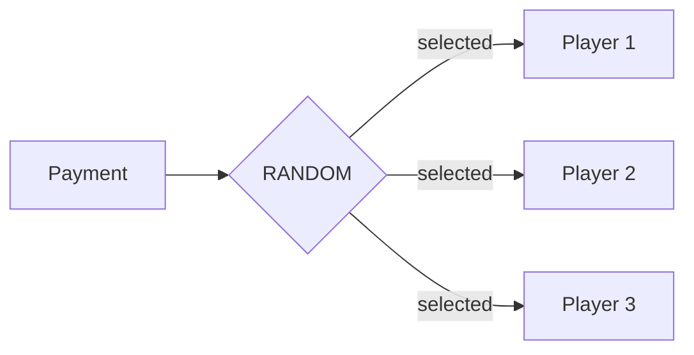
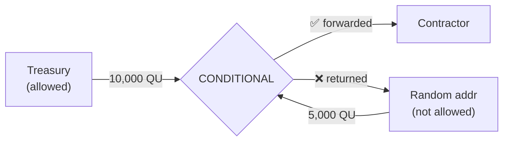
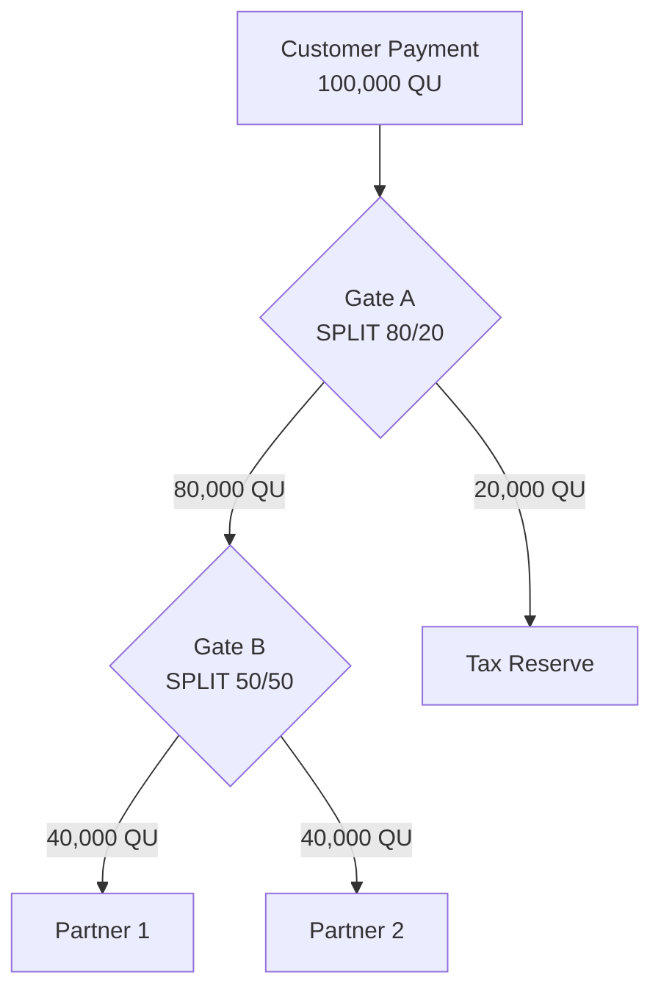
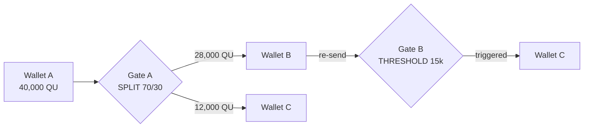

# Smart Contract — QuGate — Deflationary Payment Routing Primitive

## Proposal

Allow the QuGate Smart Contract to be deployed on Qubic. QuGate provides permissionless, multi-tenant payment routing infrastructure. It does **not** generate any revenue for shareholders. All fees generated by the use of the SC are **burned**.

**Author**: phileepphilop (Discord) — full-stack contractor  
**Source**: [github.com/fyllepo/qugate-contract](https://github.com/fyllepo/qugate-contract)  
**Funding**: None requested

### Available Options

> Option 1: Yes, allow

> Option 2: No

---

## Summary

QuGate is a **network primitive** — shared, permissionless payment routing infrastructure for Qubic. It provides the basic building blocks that every payment flow needs (splitting, sequencing, accumulation, filtering) as a single reusable contract, so that every project on Qubic doesn't have to reinvent them.

Every fee is burned. Every dust transaction is burned. QuGate is **purely deflationary** — it turns network activity into permanent QU removal.

QuGate introduces **gates** — configurable routing nodes that automatically forward QU payments according to predefined rules. Anyone can create a gate. Anyone can send through one. No operators, no admins, no middlemen. Five modes cover the most common patterns: proportional splitting, round-robin rotation, threshold accumulation, random selection, and conditional sender filtering. The CONDITIONAL mode in particular doubles as a **security layer** — enabling whitelisted payment channels, authorised spending controls, and gated access to payment flows.

**Contract Index**: TBD  
**Status**: Testnet verified (core-lite). All 5 modes, attack vectors, 50-gate stress test, gate lifecycle — all passing.

---

## What QuGate Offers

As the Qubic ecosystem grows, projects will increasingly need common payment patterns — revenue sharing, escrow accumulation, payroll distribution, conditional payments. Today, each of these would require its own smart contract proposal, vote, and IPO cycle.

QuGate provides these patterns as a **multi-tenant contract** — anyone can create and configure gates through transactions, no new contract deployments needed. One codebase to review instead of many custom implementations. Gates are composable: the output of one gate can be forwarded into another via an intermediary transaction, enabling multi-stage payment pipelines from simple building blocks.

### Deflationary by Design

QuGate generates no revenue for anyone. All creation fees are burned via `qpi.burn()`. Dust transactions (below the minimum send amount) are burned. The contract holds no accumulated funds and has no operator extracting value. Every interaction either routes payments to their intended recipients or removes QU from circulation permanently.

---

## Technical Design

### Architecture

Anyone can create a gate, configure its routing rules, and point payments at it. The contract holds no funds — payments flow through gates and out to recipients in the same tick.

### Constants

| Parameter | Value | Description |
|-----------|-------|-------------|
| `QUGATE_MAX_GATES` | 4,096 × X_MULTIPLIER | Maximum concurrent gates (scales with network) |
| `QUGATE_MAX_RECIPIENTS` | 8 | Max recipients per gate |
| `QUGATE_DEFAULT_CREATION_FEE` | 100,000 QU | Initial creation fee (shareholder-adjustable) |
| `QUGATE_DEFAULT_MIN_SEND` | 1,000 QU | Initial minimum send amount (shareholder-adjustable) |
| `QUGATE_MAX_RATIO` | 10,000 | Max ratio value (prevents overflow) |

### Five Gate Modes

#### 1. SPLIT — Proportional Distribution

Distributes incoming payments to multiple recipients according to fixed ratios. Each recipient's share is calculated using an overflow-safe formula:

$$share_i = \left\lfloor \frac{amount}{totalRatio} \right\rfloor \times ratio_i + \left\lfloor \frac{(amount \bmod totalRatio) \times ratio_i}{totalRatio} \right\rfloor$$

The last recipient receives the absolute remainder ($amount - \sum shares$) to guarantee the gate balance reaches exactly zero.

**Use cases**: Revenue sharing, royalty distribution, tax/fee splitting, multi-party payments

#### 2. ROUND_ROBIN — Rotating Distribution

Forwards each payment to the next recipient in sequence, cycling through all recipients.

**Use cases**: Fair task distribution, rotating treasury management, balanced payroll, round-robin scheduling

#### 3. THRESHOLD — Accumulate and Forward

Holds incoming payments until a threshold amount is reached, then forwards everything to the recipient at once.

**Use cases**: Crowdfunding milestones, batch payment processing, savings goals, escrow with minimum amounts

#### 4. RANDOM — Probabilistic Distribution

Pseudo-randomly selects one recipient for each payment. The selection formula:

$$recipientIndex = (totalReceived + tick) \bmod recipientCount$$

Where `totalReceived` is the gate's cumulative lifetime total and `tick` is the current Qubic tick number. Because `totalReceived` changes after each payment, multiple sends in the same tick still produce different selections. However, this is not cryptographically random — it is deterministic given known state. Suitable for fair-ish routing and reward distribution, not for high-stakes gambling.

**Use cases**: Randomized rewards, probabilistic routing, fair selection mechanisms, tip distribution

#### 5. CONDITIONAL — Sender-Restricted Forwarding

Only forwards payments from pre-approved sender addresses. Unauthorized senders' transactions are rejected without losing funds.

**Use cases**: Access-controlled payment channels, whitelisted funding, organizational spending controls, escrow with authorized parties

### Procedures

| Procedure | Description |
|-----------|-------------|
| `createGate` | Create a new gate (creation fee burned, excess refunded) |
| `sendToGate` | Send QU through a gate (dust below min send is burned) |
| `closeGate` | Close a gate (owner only) |
| `updateGate` | Modify gate configuration (owner only) |

All procedures return a `status` code: `0` = success, negative values indicate specific errors (invalid gate, unauthorized, insufficient fee, etc.). `createGate` also returns the assigned `gateId`.

### Query Functions

| Function | Description |
|----------|-------------|
| `getGate` | Query a specific gate's state |
| `getGateCount` | Get total gates, active gates, and total QU burned |
| `getGatesByOwner` | Find gates owned by an address (up to 16) |
| `getGateBatch` | Fetch up to 32 gates in a single call |
| `getFees` | Get current fee (base and escalated), min send, expiry |

### Wire Formats

Input payloads are fixed-size, little-endian, with compiler-inserted padding for alignment:

| Procedure | Input Size | Key Fields |
|-----------|-----------|------------|
| `createGate` | 600 bytes | mode(1) + recipientCount(1) + pad(6) + recipients(256) + ratios(64) + threshold(8) + allowedSenders(256) + allowedSenderCount(1) + pad(7) |
| `updateGate` | 608 bytes | gateId(8) + recipientCount(1) + pad(7) + recipients(256) + ratios(64) + threshold(8) + allowedSenders(256) + allowedSenderCount(1) + pad(7) |
| `sendToGate` | 8 bytes | gateId(8) |
| `closeGate` | 8 bytes | gateId(8) |

### Security Features

- **Owner-only operations**: Only the gate creator can close or update a gate
- **Deflationary fee model**: Creation fees and dust sends are burned via `qpi.burn()` — no QU accumulates in the contract
- **Fee overpayment refund**: Sending more than the creation fee refunds the excess automatically
- **Dust protection**: Sends below the minimum amount (default 1,000 QU) are burned, preventing spam
- **Ratio validation**: Ratios capped at 10,000 to prevent uint64 overflow in SPLIT arithmetic
- **Slot reuse**: Free-list prevents permanent DoS at gate capacity limit
- **Stale data zeroing**: Reduced recipient/sender slots are zeroed on update
- **On-chain logging**: Every operation logged with structured `QuGateLogger` events for auditability
- **Status codes**: All procedures return explicit error codes (12 defined) — no silent failures
- **Complete refund on error**: Every error path refunds `invocationReward()` to the caller
- **QPI compliant**: Uses `Array<T,N>`, `QPI::div()`/`QPI::mod()`, `_locals` structs — no prohibited operations

### Anti-Spam: Escalating Fees + Gate Expiry

Two mechanisms prevent slot exhaustion:

**Escalating creation fee** — the cost of creating a gate increases as capacity fills:

$$fee = baseFee \times \left(1 + \left\lfloor \frac{activeGates}{FEE\_ESCALATION\_STEP} \right\rfloor \right)$$

Where `FEE_ESCALATION_STEP = 1024` (shareholder-adjustable).

| Active Gates | Multiplier | Cost (at 100,000 QU base) |
|---|---|---|
| 0–1,023 | 1× | 100,000 QU |
| 1,024–2,047 | 2× | 200,000 QU |
| 2,048–3,071 | 3× | 300,000 QU |
| 3,072–4,095 | 4× | 400,000 QU |

This makes bulk slot squatting progressively expensive. The `getFees` query returns both the base fee and the current escalated fee so users know exactly what they'll pay.

**Gate expiry** — at each epoch boundary, `END_EPOCH` checks every active gate:

$$\text{if } currentEpoch - lastActivityEpoch \geq expiryEpochs \implies \text{auto-close}$$

Gates with no activity (no sends, no updates) for N epochs are automatically closed. Held balances (THRESHOLD mode) are refunded to the owner. The slot returns to the free-list. Default expiry is 50 epochs (~1 year). Expiry period is shareholder-adjustable; setting it to 0 disables expiry entirely.

Together: it's expensive to fill slots, and abandoned slots reclaim themselves.

**Acknowledged limitation**: A sufficiently motivated attacker could still occupy all slots by paying escalating fees and keeping gates active. This is a fundamental property of permissionless systems — the same way Ethereum block space can be consumed by anyone willing to pay. Our mitigations make it expensive, temporary, and self-healing, but not impossible. If a sustained slot exhaustion attack were to occur, a successor contract could introduce stronger measures (e.g. identity verification, staking requirements) informed by real-world attack data.

### Fee Governance

All three parameters — creation fee, minimum send amount, and expiry period — are stored as state variables, initialised to sensible defaults. After IPO, shareholders can vote to adjust these values using the same `DEFINE_SHAREHOLDER_PROPOSAL_STORAGE` mechanism used by QUtil and MsVault. This ensures the contract remains usable regardless of how QU value changes over time.

---

## Composability — Gates as Building Blocks

QuGate's most powerful feature is **composability**. Gates can be chained together via intermediary wallets to create multi-stage payment flows. Each hop is a separate signed transaction — the contract does not auto-forward between gates. This is a deliberate design choice: it avoids recursion risks and fee-drain attacks. In practice, chaining is handled by a client application, bot, or oracle that signs the forwarding transactions on behalf of the intermediary wallet. A future on-chain orchestrator contract (with a higher contract index) could automate multi-gate pipelines by calling QuGate's public procedures directly, removing the need for off-chain trust entirely.

### Example: Multi-Stage Revenue Pipeline

> **Note:** Each arrow between gates represents a separate signed transaction. Gate A pays a recipient wallet directly. A client application, bot, or oracle then forwards that wallet's funds through Gate B. The contract guarantees correct routing within each gate — the intermediary is responsible for forwarding between gates.

### Verified Pipeline (Tested on Testnet)

**Result**: 40,000 QU entered the pipeline. Gate A split correctly (28k/12k). Wallet B manually forwarded 28k into Gate B across two rounds (each a separate signed transaction). Gate B accumulated, triggered at threshold, and forwarded all to Wallet C. Total to Wallet C: 40,000 QU. ✅

---

## Test Results

### Environment
- **Platform**: Qubic Core-Lite (local testnet)
- **Hardware**: AMD Ryzen 9 9900X, 30GB RAM, Ubuntu 24.04
- **Duration**: 4+ hours continuous operation
- **Node stability**: Rock solid throughout all testing (20.5GB RSS, no memory growth)

### Mode Verification (5/5 Pass)

| Mode | Status | Key Finding |
|------|--------|-------------|
| SPLIT | ✅ PASS | Perfect 60/40 distribution on 10k and 50k payments |
| ROUND_ROBIN | ✅ PASS | Correct A→B→A cycling across 3 payments |
| THRESHOLD | ✅ PASS | Accumulated 10k+10k, triggered at +5k=25k, reset and re-accumulated |
| RANDOM | ✅ PASS | 33%/66% distribution across 6 payments (non-deterministic, tick-based entropy) |
| CONDITIONAL | ✅ PASS | Allowed sender forwarded, unauthorized rejected without fund loss |

### Gate Chaining POC (Pass)

- Two-gate pipeline: SPLIT → THRESHOLD (via intermediary wallet)
- 40,000 QU correctly routed through multi-gate pipeline
- Each hop was a separate signed transaction by the intermediary
- Threshold triggered across chained rounds
- Proves composability via intermediary forwarding ✅

### Attack Vector Tests (7/7 Pass)

| Attack | Result |
|--------|--------|
| Unauthorized gate close | Rejected — gate stays active ✅ |
| Send to non-existent gate | Funds safe (0 QU lost) ✅ |
| Send to closed gate | Funds safe (0 QU lost) ✅ |
| Double close | No crash, no state change ✅ |
| Zero-amount send | No effect ✅ |
| Gate slot reuse after close | Free-list works correctly ✅ |
| Owner close | Succeeds as expected ✅ |

### 50-Gate Stress Test (Pass)

| Metric | Result |
|--------|--------|
| Gates created | 50/50 across all 5 modes (10 per mode) |
| Sends confirmed | 50/50 (100% success) |
| Gates closed | 50/50 (100% success) |
| Slot reuse | 5/5 from free-list ✅ |
| Node stability | ✅ STABLE throughout |
| Memory impact | Zero growth from gate operations |

## Technical Compliance

QuGate is fully compliant with Qubic's QPI restrictions and follows established contract conventions:

- ✅ No C-style arrays — uses `Array<T,N>`
- ✅ No division/modulo operators — uses `QPI::div()` / `QPI::mod()`
- ✅ No inline local variables — uses `_locals` structs
- ✅ Uses `i++` convention (matches Qubic codebase style)
- ✅ `REGISTER_CONTRACT_FUNCTIONS_AND_PROCEDURES` implemented
- ✅ Proper epoch type (`uint16`) and amount type (`sint64`)
- ✅ `QUGATE2` empty struct (Qubic convention for future extension)
- ✅ `X_MULTIPLIER` for capacity scaling (follows MsVault, Quottery pattern)
- ✅ Structured logging with `_terminator` field (follows QUtil, MsVault, Qearn pattern)
- ✅ Status codes on all procedure outputs (follows MsVault, Qearn pattern)
- ✅ Fee overpayment refund (follows QUtil, MsVault, Qearn pattern)
- ✅ Private validation helper functions (follows MsVault pattern)

---

## Known Limitations

Honest disclosure of what QuGate does not do or does imperfectly:

1. **Slot exhaustion possible**: A sufficiently funded attacker could occupy all gate slots by paying escalating fees and keeping gates active. Escalating fees and expiry make this expensive and temporary, but not impossible.
2. **RANDOM is not cryptographic**: Tick-based entropy is the only option in QPI. A miner could theoretically influence selection. Suitable for routing, not for high-stakes gambling.
3. **O(n) queries**: `getGatesByOwner` and `END_EPOCH` expiry scan all allocated slots linearly. Bounded by `QUGATE_MAX_GATES` — acceptable at current scale but does not scale indefinitely.
4. **THRESHOLD refund goes to owner, not senders**: If a THRESHOLD gate is closed or expires before reaching its target, the held balance refunds to the gate owner — not the individual contributors. This is a deliberate simplification (tracking per-sender contributions would require unbounded state).

---

## Security Threat Model

| Threat | Mitigation | Residual Risk |
|--------|-----------|---------------|
| **Slot exhaustion** — attacker fills all gate slots | Escalating fees (4x at capacity), gate expiry reclaims abandoned slots, free-list recycles closed slots | A funded attacker willing to pay escalating fees and keep gates active could maintain exhaustion. Minimum cost: ~1B QU at full capacity, plus periodic keep-alive transactions. |
| **Dust spam** — millions of tiny payments to waste computation | Sends below minSendAmount are burned (costs the attacker), zero-amount sends are no-ops, each send is O(1) | Sends of exactly minSendAmount are processed normally. At 1,000 QU per transaction, sustained spam is not economically viable. |
| **RANDOM manipulation** — predicting recipient selection | `tick()` is not known to sender at submission time, `totalReceived` varies per payment | A computor node operator could theoretically observe the tick and selectively include/exclude transactions. This is a network-level concern, not specific to QuGate. |
| **Owner rug-pull** — owner changes recipients after integration | Mode is immutable, all state is queryable (changes are visible on-chain) | Senders must trust the owner won't change recipients/ratios, or monitor for changes. |
| **THRESHOLD custody** — owner closes gate to take accumulated funds | By design: owner has custody. Senders should understand this before contributing. | Analogous to sending funds to any address — you trust the recipient. |
| **Re-entrancy** | Non-issue: Qubic processes transactions sequentially within a tick. No callback mechanism exists. | None. |

---

## Possible Applications

QuGate is general-purpose payment infrastructure. Any application that needs to route, split, accumulate, or conditionally forward QU can be built on top of it with zero additional smart contract development — just a frontend calling `createGate` and `sendToGate`.

Some ideas:

- **DAO treasury** — Chain gates via intermediary to encode treasury policy: revenue → SPLIT (ops, grants, reserves) → oracle forwards grants portion into THRESHOLD that releases when enough accumulates.
- **Team payroll** — Client pays one address, SPLIT gate distributes to all team members by agreed shares.
- **Crowdfunding** — THRESHOLD gate as a funding round. Nothing moves until the goal is reached. Resets for the next milestone.
- **Raffle / lottery** — RANDOM gate, provably fair, tick-based entropy visible on-chain. No trusted draw operator.
- **Spending controls** — CONDITIONAL gate restricts which wallets can trigger payments. Unauthorized senders get funds returned.
- **Creator revenue sharing** — SPLIT gate distributes royalties or tips across collaborators automatically.
- **Escrow** — THRESHOLD + CONDITIONAL via intermediary: only buyer can deposit into CONDITIONAL gate, intermediary forwards to THRESHOLD gate, funds release when agreed amount is reached.
- **Payment batching** — THRESHOLD gate accumulates small payments and forwards in efficient batches.
- **Revenue pipelines** — Chain SPLIT gates via intermediary for multi-layer distribution (merchant → platform → operations → marketing). Each stage requires a forwarding transaction.
- **Fair work distribution** — ROUND_ROBIN cycles payments across members of a pool or cooperative.

Each of these requires no new contracts, no governance votes, no additional audits. The routing logic is already deployed and tested.

---

## Example Gate Configurations

Five modes, infinite configurations. Here are concrete gates people could create on day one:

| Gate | Mode | Configuration | What It Does |
|------|------|---------------|--------------|
| **Payroll** | SPLIT | Ratios match salary proportions | Company pays one address, everyone gets their cut |
| **Treasury diversification** | SPLIT | 50/30/20 across hot/cold/staking | Incoming revenue auto-distributes across wallets |
| **Tax withholding** | SPLIT | 80/20 → recipient / tax reserve | Automatic tax set-aside before funds are touched |
| **Donation splitter** | SPLIT | Ratios by contributor weight | Open-source project distributes donations fairly |
| **Team tip jar** | RANDOM | 5 team members | Each tip randomly goes to one person |
| **Raffle** | RANDOM | N participant addresses | Each ticket purchase picks a random winner |
| **Crowdfunding round** | THRESHOLD | 100,000 QU target | Nothing moves until the goal is hit, then releases all |
| **Micropayment batcher** | THRESHOLD | 10,000 QU minimum | Collects small payments, forwards in efficient batches |
| **Multi-sig lite** | THRESHOLD | Low threshold, multiple senders | Multiple parties must collectively fund before release |
| **Service load balancer** | ROUND_ROBIN | 4 compute nodes | Each payment rotates to the next node |
| **Fair task queue** | ROUND_ROBIN | N worker addresses | Work payments cycle through workers equally |
| **Authorised spending** | CONDITIONAL | CFO + finance wallets allowed | Only approved addresses can trigger vendor payments |
| **Bot profit routing** | CONDITIONAL | Only bot address allowed | Arbitrage bot profits auto-forward to cold wallet |
| **Dead man's switch** | CONDITIONAL + THRESHOLD | Backup wallet only, high threshold | Emergency fund: only backup can trigger, requires minimum amount |
| **Revenue pipeline** | SPLIT → SPLIT (chained) | 80/20 then 50/50 on the 80% | Multi-layer distribution via intermediary forwarding |
| **Funding with escrow** | CONDITIONAL → THRESHOLD (chained) | Whitelist senders, accumulate to target | Only approved backers, intermediary forwards to threshold, funds release at milestone |

The creativity is built on top. QuGate provides the plumbing — users wire it however they need.

---

## Future Extensibility

QuGate is designed to evolve without redeployment:

- **`QUGATE2`**: Empty successor struct follows Qubic convention. If a fundamental redesign is needed, a successor contract can be deployed.
- **Shareholder governance**: Three adjustable parameters — creation fee, minimum send amount, and expiry period.

Possible future features (based on real-world usage patterns after mainnet):
- Immutable gate flag (permanently lock configuration for sender trust)
- Higher recipient limits (if state size constraints relax)
- Cross-contract triggers (gates that invoke other contracts when activated)

---

## Open Items for Computor / IPO Decision

The following items require community input or will be finalised during the proposal and IPO process:

### 1. Contract Asset Name
The `QUGATE_CONTRACT_ASSET_NAME` constant needs to be set using `assetNameFromString("QUGATE")` during contract registration. This enables the shareholder proposal infrastructure for fee governance.

### 2. Contract Index
Currently proposed as index 24. Final index will be assigned during the proposal process.

### 3. Initial Fee Values
- **Creation fee**: 100,000 QU (default)
- **Minimum send amount**: 1,000 QU (default) — prevents dust spam, burned on rejection

Both fees are **shareholder-adjustable** after IPO via the built-in QPI proposal/voting mechanism. The initial values only need to be "good enough" — shareholders can vote to change them at any time.

### 4. Shareholder Fee Governance
The contract includes state variables for fees and a `getFees` query, with an `END_EPOCH` stub ready to wire into QPI's `DEFINE_SHAREHOLDER_PROPOSAL_STORAGE` macro. The voting infrastructure is the same battle-tested pattern used by QUtil and MsVault. Full wiring requires the contract asset name (item 1 above).

### 5. Gate Capacity
`QUGATE_MAX_GATES = 4096 * X_MULTIPLIER`. This is the number of **concurrently active** gates, not a lifetime limit. Closed and expired gates free their slots via the free-list — the contract can process unlimited gates over its lifetime. At X_MULTIPLIER=1 this is 4,096 concurrent gates; at X_MULTIPLIER=10 it's 40,960. Capacity grows automatically as the network scales. Is 4,096 a reasonable base?

### 6. Maximum Recipients Per Gate
Currently 8 recipients per gate. Increasing this grows per-gate state size. Is 8 sufficient for the use cases the community cares about?

### 7. Gate Expiry Period
Default: 50 epochs (~1 year) of inactivity before auto-close. Shareholder-adjustable. Set to 0 to disable expiry entirely. Is 50 epochs the right default?

---

## FAQ

**Q: Why not just write custom contracts for each use case?**  
A: Custom contracts require their own proposal, vote, IPO, and audit cycle. QuGate handles the most common patterns in one contract, saving months of governance overhead per use case.

**Q: Can gates be updated after creation?**  
A: Yes. The gate owner can call `updateGate` to modify recipients, ratios, thresholds, and allowed senders. Validation ensures updates are safe.

**Q: What happens if someone sends funds to a closed or non-existent gate?**  
A: The transaction is rejected and funds are not lost. This has been verified through attack vector testing.

**Q: Is there a risk of the contract running out of gate slots?**  
A: The free-list system recycles closed gate slots. When a gate is closed, its slot becomes available for new gates. This has been verified with stress testing.

**Q: How random is RANDOM mode?**  
A: RANDOM mode uses `(totalReceived + tick()) % recipientCount` for selection. This is pseudo-random, not cryptographic. Because `totalReceived` is cumulative and changes with each payment, multiple sends in the same tick will route to different recipients. However, the selection is deterministic given known state — a sophisticated actor could predict the outcome. This is acceptable for payment routing and reward distribution, but not suitable for high-stakes gambling or scenarios where predictability is a security concern. Testing confirmed non-deterministic distribution across multiple sends.

**Q: What's the maximum number of recipients per gate?**  
A: 8 recipients. This covers virtually all practical use cases while keeping the state compact.

**Q: What if QU value changes and fees become too expensive?**  
A: Fees are not hardcoded. Both the creation fee and minimum send amount are state variables that IPO shareholders can vote to change at any time, using the same governance mechanism as QUtil and MsVault. The initial values (100,000 QU / 1,000 QU) are just starting points.

**Q: Where do the fees go?**  
A: All fees are burned via `qpi.burn()`. No QU accumulates in the contract and no one profits from fees. QuGate is purely deflationary.

**Q: What happens if I overpay the creation fee?**  
A: The excess is refunded automatically. Only the exact creation fee is burned.

---

## About

Developed and tested on Ubuntu 24.04 using Qubic Core-Lite for local testnet validation. All testing conducted with real contract execution on a live (local) Qubic node, not simulations.

Also maintaining [qubic-mcp](https://github.com/fyllepo/qubic-mcp) — an MCP tool for querying Qubic smart contracts.

## Code

[PR](https://github.com/qubic/core/pull/773)
